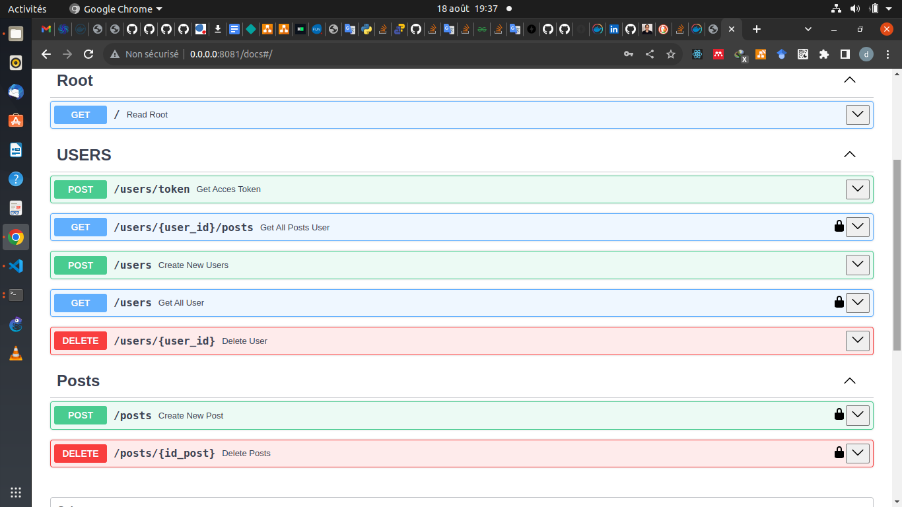

# 🚀 FastAPI Async Template with PostgreSQL

[](https://fastapi.tiangolo.com/)
[](https://www.postgresql.org/)
[](https://www.docker.com/)
[](LICENSE)
[]()


Welcome to the **FastAPI Async Template** — a clean and modern starter for building **asynchronous APIs** powered by **FastAPI** ⚡ and **PostgreSQL** 🐘.

Dive deeper into the full project documentation here:  
📚 [Deep Documentation](https://deepwiki.com/darixsamani/fastapi-postgres)  
🐳 [Docker Hub Images](https://hub.docker.com/repository/docker/darixsamani/fastapipostgresql/general)

---

## ✨ Features

✅ **FastAPI** — lightning-fast backend framework  
🐘 **PostgreSQL** — robust and reliable database  
📦 **Docker Compose** — easy setup and environment management  
🔐 **Authentication** — secure user handling  
⚙️ **Alembic** — smooth database migrations  
🧠 **Async Support** — fully asynchronous stack  
📊 **PGAdmin4** — visual database management  
🧱 **SQLModel** — type-safe ORM integration  

---

## 🐘 Run PostgreSQL Instance (via Docker)

Start a local PostgreSQL instance with Docker:


```bash
docker run -d \
  --name salvo_postgres \
  -e POSTGRES_USER=darix \
  -e POSTGRES_PASSWORD=6775212952 \
  -e POSTGRES_DB=salvo_postgres \
  -p 5432:5432 \
  postgres:latest
```

## 🧠 Run Application

Before running the application, make sure that uv (the ultra-fast Python package and environment manager) is installed on your system 🧩

⚙️ Install uv (if not installed yet):

```bash
pip install uv
```

Once installed, you can easily run your FastAPI app with a single command 💨

```bash
uv run main.py
```

## 🧭 Quick Start Guide

Follow these simple steps to get your app running in no time ⏱️

### 🐳 1. Start with Docker Compose

```bash
docker compose up -d --build
```


### 🔄 2. Run the First Migration

Initialize and apply your first migration using Alembic 🚀

```
docker compose exec app uv run alembic revision --autogenerate -m "first migration"
docker compose exec app uv run alembic upgrade head
 ```

### 🌐 3. Access the API Docs

Open the FastAPI interactive docs at:
👉 [http://0.0.0.0:8001/docs](http://0.0.0.0:8001/docs)


### 🗂️ 4. PGAdmin4 Access

Manage your PostgreSQL database visually via PGAdmin4 🎛️

Access URL: [http://localhost:5050](http://localhost:5050)

Server Name: `db`

Port: `5434`

Username: `admin@gmail.com`

Password: `admin`


### 🧩 5. Example Preview

 
